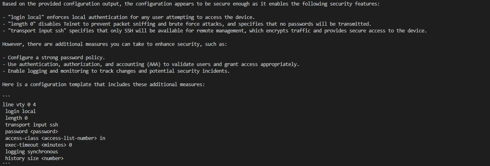

# ai_cybersecurity_compliance
AI-Powered CyberSecurity Compliance: Boost Network Security with PYATS & OpenAI GPT-3.5-turbo

Revolutionize your  network device audits and security enhancements using Cisco's PYATS and cutting-edge artificial intelligence.

## Introduction:
Step into the future of cybersecurity compliance with our Python script designed to streamline the auditing and security enhancement process for your Cisco network devices. Harness the power of OpenAI's GPT-3.5-turbo model to evaluate device configurations and receive actionable recommendations for optimizing security.

## Key Features:

Automated Device Connection: Effortlessly connect to multiple Cisco network devices using a YAML testbed file, bringing automation and simplicity to the auditing process across your entire network.

Expert AI Analysis: Rely on the OpenAI GPT-3.5-turbo model to meticulously examine your devices' configurations, providing you with unparalleled security recommendations rooted in best practices.

Instant Security Improvements: Receive timely, practical suggestions for enhancing your network security, empowering you to take immediate action based on AI-generated insights.

Robust Error Handling: Benefit from a script built to catch exceptions and log error messages, promoting efficient debugging and ensuring a smooth auditing experience.

## How It Works:

1. Connect to each network device outlined in a YAML testbed file.
2. Extract the devices' configurations and forward them to the OpenAI GPT-3.5-turbo model for analysis.
3. Leverage the AI model's expertise to identify more secure configuration alternatives.
4. Implement the AI-crafted recommendations to bolster your network security.

## Solution Components
*Python
*Genie
*PYATS
*OpenAI

## Prerequisites 

Python3.6 and above

## Toolbox

Main.py: includes the main script run which contains relevant code to connect to the devices highlighted in the testbed file and returns the outcome as a json file.

Gene.yml: this is the PYATS testbed file that contains the device/devices that would be connected to. 

You can test this on Cisco's DevNet Sandbox Labs/IOS XE on CSR Latest Code - AlwaysOn/IOS XE on CSR Latest Code AlwaysOn1

## Step 1 - Downloading - Option A Using a Docker Image

1. Download and setup docker suitable for your Operating System 
https://docs.docker.com/get-docker/

2. Download the latest version of the PYATS from docker hub

$ docker pull ciscotestautomation/pyats:latest

3. Run the docker image 

$ docker run -it ciscotestautomation/pyats:latest /bin/bash

4. Clone the repository

git clone https://github.com/yzmar4real/ai_cybersecurity_compliance.git

5. CD into the directory 

cd ai_cybersecurity_compliance

6. (Optional) Use the directory as a virtual environment for the project

python3 -m venv . 

7. (Optional) Start the virtual environment and install the requirements for the project

source bin/activate

8. Install Open AI 

pip3 install openai

## Step 1 - Downloading - Option B Using GIT

1. Clone the repository

git clone https://github.com/yzmar4real/ai_cybersecurity_compliance.git

2. CD into the directory 

cd ai_cybersecurity_compliance

3. (Optional) Use the directory as a virtual environment for the project

python3 -m venv . 

4. (Optional) Start the virtual environment and install the requirements for the project

source bin/activate

5. Install Open AI 

pip3 install openai

6. Install PyATS

pip3 install pyats['standard']

## Step 2 - Defining the Testbed for devices to be audited

1. Edit genie.yml file to include parameters for your devices. 

## Step 3 - Executing the Script 

1. Execute the main script from console

python3 Main.py

## Code Breakdown

1. Importing required libraries:

json: Handles JSON data.
logging: Provides logging capabilities.
pandas: A library for data manipulation and analysis.
requests: A library for making HTTP requests.
genie.testbed: A library from Cisco's pyATS framework to interact with network devices.
openai: A library to interact with OpenAI's GPT models.
Setting the OpenAI API key:

2. openai.api_key: Configures the API key for the OpenAI library.

3. Defining the testbed file:

testbed_file: A variable storing the path to the testbed file, which is a YAML file containing network device information.
Loading the testbed file and iterating through each device:

with load(testbed_file) as testbed: Loads the testbed file and creates a context manager for handling the devices.
for dev in testbed: Iterates through each device in the testbed.
Connecting to each device and executing commands:

dev.connect(...): Connects to the current device.
config_output = dev.execute('show run | i username'): Executes the command to display the running configuration filtered by lines containing the keyword 'username'.
Preparing the OpenAI GPT-3.5-turbo model request:

messages: A list of dictionaries that represent a conversation between a system and a user, asking the model to review the configuration and suggest a more secure one.
Sending the request and processing the response:

response = openai.ChatCompletion.create(...): Sends the request to the GPT-3.5-turbo model.
result = ...: Extracts the content of the response from the model.
print(result): Prints the result, which contains the model's recommendations for more secure configurations.
Error handling:

except Exception as e: Catches any exceptions that might occur during the execution of the script.
logging.error(str(e)): Logs the error message to help with debugging.
Usage: To use this script, create a YAML testbed file containing information about the network devices you want to audit. Then, provide your OpenAI API key and execute the script. The script will output the GPT-3.5-turbo model's recommendations for improving the security of your devices.

## Outputs

## Conclusion:
Elevate your cybersecurity compliance by adopting artificial intelligence to audit and enhance your network devices. This Python script, powered by OpenAI's GPT-3.5-turbo model, equips you with the advanced capabilities needed to strengthen network security and stay ahead of emerging threats. Transform your network security management with AI-driven insights today!

## Contacts
*Oluyemi Oshunkoya (yemi_o@outlook.com)

## Generative AI Disclaimer

This repository requires interaction with 3rd-party Generative AI platform. All your data and software or device output that you enter as a part of the prompt can be used for research or retraining the models. For ChatGPT, see https://openai.com/policies/privacy-policy Chapter "8. Security and Retention" and "9. International users"
